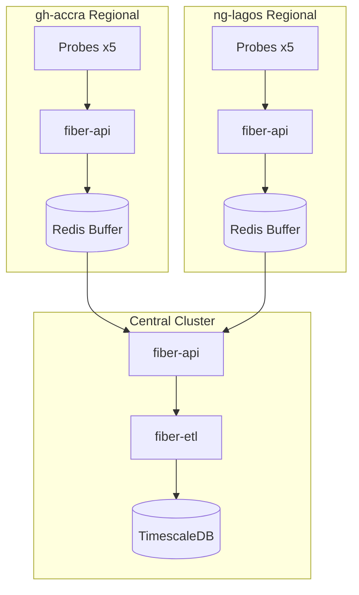

# FiberStack-Lite Architecture Freeze

**Version:** 1.4 (Day 75 Black Signal)  
**Freeze Date:** 2025-12-30  
**Status:** **LOCKED**

---

## 1. Executive Summary

Distributed network monitoring system for 10-20 nodes across Ghana, Nigeria, and Kenya with federated ingestion.

---

## 2. Frozen Decisions

| Category | Decision | Rationale | Change Impact |
|----------|----------|-----------|---------------|
| **Dashboard** | **Grafana** | Speed to market, OOTB features | Critical |
| **Database** | **TimescaleDB** | Time-series optimized | Critical |
| **Queue** | **Redis** | Simple, fast | Medium |
| **API** | **FastAPI** | Async, type-safe | High |
| **Cluster** | **3-Tier Federation** | Scalability, fault tolerance | High |

---

---

## 3. Rationale: Alternatives Considered

### Rate Limiting
- **Chosen**: **Token Bucket** with Local Fallback (Distributed by default).
- **Alternative**: Leaky Bucket (Rejected).
- **Reason**: Leaky Bucket enforces constant rate, which harms "bursty" probe behavior after network outage recovery. Token Bucket allows configured bursts.
- **Alternative**: Fixed Window (Rejected).
- **Reason**: Susceptible to boundary stamping (2x load at minute boundary).

### Message Queue
- **Chosen**: **Redis List/Streams**.
- **Alternative**: Apache Kafka (Rejected).
- **Reason**: Operations overhead too high for MVP scale (10-20 probes). Redis is built-in.
- **Trigger for Change**: When throughput exceeds 100k events/sec.

---

## 4. Service Boundaries

1. **fiber-probe**: Collect and push only. No local storage.
2. **fiber-api**: Stateless ingestion + read queries.
3. **fiber-etl**: Sole writer to metrics. Evaluates alerts.
4. **fiber-dashboard**: Grafana for viz, React for admin.

---

## 4. Data Model

- **Primary Key**: UUID
- **Time Precision**: Milliseconds (TIMESTAMPTZ)
- **Retention**: Raw 7d, Hourly 90d, Daily 1y

---

## 5. Change Control

1. Proposal → 2. Review → 3. Migration Plan → 4. Version Bump

---

## 6. Sign-Off

**Architect:** Black Signal | **Date:** 2025-12-30 (v1.4)

---

## 7. Cluster Topology

| Role | Autonomy | Persistence | HA Posture |
|------|----------|-------------|------------|
| **Central** | Full | TimescaleDB | Active+Passive (Phase 5) |
| **Regional** | Partial | Redis AOF 24h | Single instance |
| **Edge Probe** | None | Memory | N/A |

---

## 8. Federation Modes

| Mode | Path | Trigger |
|------|------|---------|
| **Direct** | Probe → Central | Low-latency |
| **Relay** | Probe → Regional → Central | Default |
| **Degraded** | Probe → Regional (buffer) | Central down |
| **Fallback** | Probe → Central | Regional down |

**Replay**: At-least-once. **Idempotency**: `node_id + timestamp`.

---

## 9. Trust Model

**Central is root of trust.** Region tokens are scoped + revocable.

| Relationship | Trust Direction |
|--------------|-----------------|
| Central → Regional | Issues tokens |
| Regional → Probe | Validates tokens |

---

## 10. Failure Semantics

| Failure | Behavior |
|---------|----------|
| Central Down | Regional buffers 24h |
| Regional Down | Probes fallback |
| Partition | Delayed, not lost |

---

## 11. Federation Observability

| Metric | Source |
|--------|--------|
| `federation_queue_depth` | Regional Redis |
| `replay_lag_seconds` | Regional API |
| `ingest_drop_count` | Probe |
| `central_last_seen` | Regional |

---

## 12. Invariants (MUST NOT VIOLATE)

| ID | Invariant | Rationale |
|----|-----------|-----------|
| I-01 | **No Regional writes to DB** | Central is sole writer |
| I-02 | **All aggregation is Central** | Consistency guarantee |
| I-03 | **Redis buffers survive 24h outage** | AOF + TTL policy |
| I-04 | **Idempotency on `node_id + timestamp`** | Deduplication contract |
| I-05 | **Probes never store locally > 1000 samples** | Memory safety |
| I-07 | **Fairness Guarantee** | No single tenant > 20% capacity during contention (User-based limits). |
| I-08 | **Trace ID Continuity** | `X-Trace-ID` must persist from Probe → API → ETL → ES. |
| I-09 | **Fail-Safe Logging** | Logging failures MUST NOT crash the application. |

> [!CAUTION]
> Violating any invariant voids data consistency guarantees.
