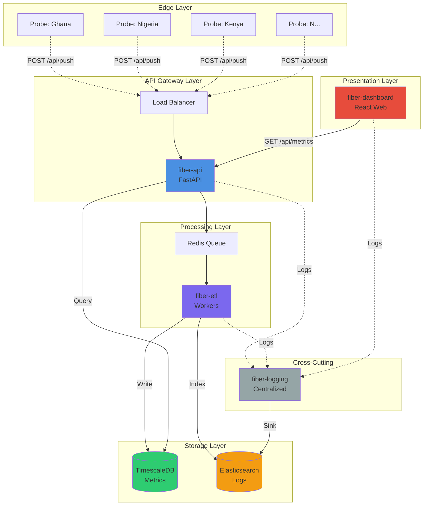
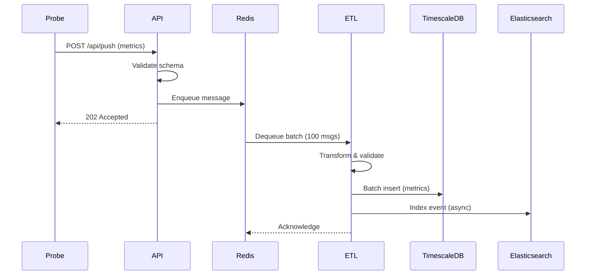
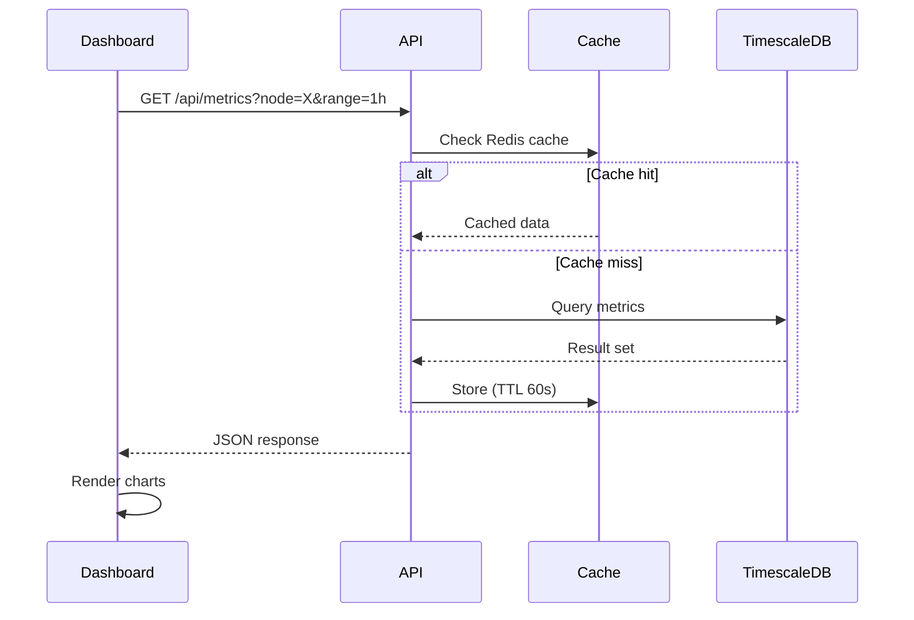

# FiberStack-Lite System Blueprint

**Version:** 1.0  
**Date:** 2025-11-24  
**Status:** Draft (Pending Freeze)

---

## Executive Summary

**FiberStack-Lite** is a distributed network infrastructure monitoring system designed to collect, process, and visualize performance metrics (latency, uptime, packet loss) from geographically distributed probe nodes across Africa. The system enables real-time monitoring and historical analysis of network health across multiple regions.

**Target Users:**
- Network operators monitoring infrastructure performance
- SRE teams tracking service availability
- Organizations with distributed infrastructure across African regions

**Key Differentiators:**
- **Geographic focus**: Optimized for African infrastructure (Ghana, Nigeria, Kenya)
- **Lightweight probes**: Minimal resource footprint for edge deployment
- **Time-series optimized**: Built on TimescaleDB for efficient historical queries
- **Modular architecture**: Independent services for easier scaling and maintenance

**MVP Scope:**
- 10-20 probe nodes across 3 countries (Ghana, Nigeria, Kenya)
- Real-time metrics collection (1-minute intervals)
- Web dashboard with interactive visualizations
- 7-day metric retention with hourly aggregation

---

## System Architecture

### High-Level Overview



### Service Boundaries

| Service | Responsibility | Never Does |
|---------|---------------|------------|
| **fiber-probe** | Collect local metrics, push to API | Direct DB writes, query data, serve HTTP |
| **fiber-api** | Receive data, validate, route requests | Heavy transformations, chart rendering, raw DB writes |
| **fiber-etl** | Normalize, transform, load data | Serve public endpoints, render dashboards, trigger probes |
| **fiber-db** | Schema management, migrations | Business logic, API endpoints, data validation |
| **fiber-dashboard** | Visualize metrics, UI/UX | Store data, process metrics, modify ETL/API |
| **fiber-logging** | Centralized logging, formatting | Application business logic |

---

## Module Specifications

### 1. fiber-probe (Metrics Collection Agent)

**Technology:** Python 3.11+  
**Framework:** asyncio-based lightweight daemon  
**Deployment:** Edge nodes (10-20 instances in MVP)

**Architecture:**
```
┌─────────────────────────────────┐
│  Probe Scheduler (Cron-like)   │
├─────────────────────────────────┤
│  Metric Collectors:             │
│  - Latency (ping/http)          │
│  - Uptime (service checks)      │
│  - Packet Loss (network probe)  │
├─────────────────────────────────┤
│  Data Formatter (JSON)          │
├─────────────────────────────────┤
│  HTTP Client (to fiber-api)     │
└─────────────────────────────────┘
```

**Configuration:** `probe.yaml`
```yaml
node_id: "probe-gh-accra-01"
region: "Ghana"
country: "GH"
api_endpoint: "https://api.fiberstack.io/api/push"
interval_seconds: 60
metrics:
  - latency
  - uptime
  - packet_loss
```

**Key Features:**
- Runs as systemd service or Docker container
- Retries with exponential backoff on API failures
- Local buffer for offline operation (max 1000 samples)
- Minimal CPU/memory footprint (<50MB RAM, <5% CPU)

---

### 2. fiber-api (API Gateway)

**Technology:** Python 3.11+  
**Framework:** FastAPI (async, auto-docs, type validation)  
**Deployment:** 2+ instances behind load balancer

**Architecture:**
```
┌─────────────────────────────────┐
│  FastAPI Application            │
├─────────────────────────────────┤
│  Endpoints:                     │
│  - POST /api/push (probe data)  │
│  - GET /api/metrics (dashboard) │
│  - GET /api/nodes (node list)   │
│  - GET /api/status (health)     │
├─────────────────────────────────┤
│  Middleware:                    │
│  - CORS, Rate Limiting, Auth    │
├─────────────────────────────────┤
│  Queue Client (Redis)           │
└─────────────────────────────────┘
```

**Key Responsibilities:**
1. **Validation**: Pydantic models for request/response
2. **Authentication**: API key validation (future: OAuth2)
3. **Rate Limiting**: 100 req/min per probe, 1000 req/min per dashboard
4. **Routing**: Push data to ETL queue, query DB for reads
5. **Error Handling**: Structured error responses, logging

**API Contracts:**

**POST /api/push**
```json
Request:
{
  "node_id": "probe-gh-accra-01",
  "country": "GH",
  "region": "Ghana",
  "latency_ms": 45.2,
  "uptime_pct": 99.5,
  "packet_loss": 0.1,
  "timestamp": "2025-11-24T16:00:00Z"
}

Response:
{
  "status": "accepted",
  "queued": true,
  "message_id": "uuid-here"
}
```

**GET /api/metrics**
```json
Query Params: ?node_id=xyz&start=timestamp&end=timestamp&aggregation=hourly

Response:
{
  "node_id": "probe-gh-accra-01",
  "timeframe": {"start": "...", "end": "..."},
  "data": [
    {"time": "2025-11-24T16:00:00Z", "latency_ms": 45.2, "uptime_pct": 99.5, "packet_loss": 0.1},
    ...
  ]
}
```

---

### 3. fiber-etl (Extract-Transform-Load Pipeline)

**Technology:** Python 3.11+  
**Framework:** Custom async workers with Redis queue  
**Deployment:** 2-4 worker processes

**Architecture:**
```
┌─────────────────────────────────┐
│  Redis Queue Consumer           │
├─────────────────────────────────┤
│  Transformations:               │
│  - Data validation              │
│  - Timestamp normalization      │
│  - Unit conversion              │
│  - Outlier detection            │
├─────────────────────────────────┤
│  Loaders:                       │
│  - TimescaleDB (metrics)        │
│  - Elasticsearch (events)       │
├─────────────────────────────────┤
│  Aggregation Jobs (Hourly)      │
└─────────────────────────────────┘
```

**Processing Pipeline:**
1. **Extract**: Pull from Redis queue
2. **Validate**: Schema check, range validation (latency: 0-10000ms, uptime: 0-100%, etc.)
3. **Transform**: Normalize timestamps to UTC, convert units, flag anomalies
4. **Load**: Batch insert to TimescaleDB (100 records/batch)
5. **Index**: Send events to Elasticsearch (async)
6. **Aggregate**: Hourly aggregation job (via cron)

**Error Handling:**
- Invalid data → Error queue for review
- DB connection loss → Retry with exponential backoff (max 5 attempts)
- Failed batches → Dead letter queue

---

### 4. fiber-db (Database Layer)

**Primary:** TimescaleDB (PostgreSQL extension)  
**Secondary:** Elasticsearch 8.x  
**Cache:** Redis (optional)

**See [DATA_MODEL.md](file:///Users/macpro/FiberStack-Lite/docs/DATA_MODEL.md) for complete schemas**

**Key Design Decisions:**
- **TimescaleDB Hypertables**: Auto-partitioning by time (1-week chunks)
- **Indexing Strategy**: Compound indexes on (node_id, time DESC)
- **Aggregation**: Continuous aggregates for hourly/daily rollups
- **Retention**: Raw data (7 days), hourly (90 days), daily (1 year)

---

### 5. fiber-dashboard (Visualization Layer)

**Technology:** React 18+, TypeScript  
**Framework:** Create React App (MVP), migrate to Next.js later  
**Deployment:** Static hosting (Vercel/Netlify) or nginx

**Architecture:**
```
┌─────────────────────────────────┐
│  React Application              │
├─────────────────────────────────┤
│  Pages:                         │
│  - Dashboard (overview)         │
│  - Node Details                 │
│  - Map View                     │
│  - Analytics                    │
├─────────────────────────────────┤
│  Components:                    │
│  - Charts (Chart.js/Recharts)   │
│  - Map (Leaflet)                │
│  - Filters (date, node, region) │
├─────────────────────────────────┤
│  API Client (axios)             │
└─────────────────────────────────┘
```

**Key Features:**
- **Real-time Updates**: WebSocket for live metrics (Phase 4+)
- **Interactive Map**: Geographic view of all probes
- **Time-series Charts**: Latency, uptime, packet loss trends
- **Filters**: By node, region, time range
- **Responsive Design**: Mobile-friendly

**Tech Stack:**
- **UI Library**: Material-UI or Ant Design
- **Charts**: Chart.js or Recharts
- **Maps**: React-Leaflet
- **State Management**: React Context (MVP), Redux Toolkit (later)
- **API Client**: Axios with React Query

---

### 6. fiber-logging (Centralized Logging)

**Technology:** Python 3.11+  
**Architecture:** Library/package used by all services  
**Storage:** Elasticsearch

**Current Implementation:** ✅ Already working
- Structured logging (JSON format)
- Log levels: DEBUG, INFO, WARNING, ERROR, CRITICAL
- Context injection: service_name, request_id, node_id
- Multiple handlers: Console, File, Elasticsearch

**See existing code:**
- [configurator.py](file:///Users/macpro/FiberStack-Lite/fiber-logging/src/configurator.py)
- [logger.py](file:///Users/macpro/FiberStack-Lite/fiber-logging/src/logger.py)

---

## Technology Stack

### Programming Languages

| Layer | Language | Version | Rationale |
|-------|----------|---------|-----------|
| Backend (API, ETL, Probe) | Python | 3.11+ | Async support, rich ecosystem, team expertise |
| Frontend | TypeScript | 5.x | Type safety, better DX, React ecosystem |
| Database | SQL | PostgreSQL 15+ | TimescaleDB requirement |

### Frameworks & Libraries

| Component | Technology | Version | Purpose |
|-----------|-----------|---------|---------|
| API | FastAPI | 0.104+ | High-performance async API, auto docs |
| Dashboard | React | 18+ | Component-based UI, large ecosystem |
| ORM | SQLAlchemy | 2.0+ | Database abstraction, migrations |
| Queue | Redis | 7.x | Message queue, caching |
| Charts | Chart.js | 4.x | Interactive visualizations |
| Maps | Leaflet | 1.9+ | Geographic visualization |

### Infrastructure

| Component | Technology | Purpose |
|-----------|-----------|---------|
| **Database** | TimescaleDB 2.11+ | Time-series metrics storage |
| **Search & Logs** | Elasticsearch 8.x | Log aggregation, full-text search |
| **Message Queue** | Redis Streams | Async task queue (ETL pipeline) |
| **Containerization** | Docker 24+ | Service isolation |
| **Orchestration** | Docker Compose | Multi-container management (dev/staging) |
| **Reverse Proxy** | nginx | Load balancing, SSL termination |
| **Monitoring** | Prometheus + Grafana | System observability |

---

## Data Flow Patterns

### Write Path (Probe → Database)



**Throughput:** ~10,000 metrics/min with 2 ETL workers

### Read Path (Dashboard → Database)



**Performance:** <200ms p95 latency for dashboard queries

---

## Integration Points

### Inter-Service Communication

| From | To | Protocol | Purpose |
|------|----|----|---------|
| Probe | API | HTTP/REST | Push metrics |
| API | ETL | Redis Queue | Async processing |
| ETL | TimescaleDB | PostgreSQL protocol | Store metrics |
| ETL | Elasticsearch | HTTP/REST | Index logs |
| Dashboard | API | HTTP/REST | Query metrics |
| All Services | Logging | Library call | Centralized logs |

### External Dependencies

- **NTP Servers**: Time synchronization across probes
- **DNS**: Service discovery
- **SSL/TLS**: Let's Encrypt for HTTPS (production)

### Authentication & Authorization

**Phase 1 (MVP):**
- API keys for probes (static, env vars)
- No authentication for dashboard (internal use)

**Phase 2+:**
- OAuth2 for dashboard users
- JWT tokens for API access
- Role-based access control (RBAC)

---

## Non-Functional Requirements

### Performance

| Metric | Target | Measurement |
|--------|--------|-------------|
| API Latency (write) | <100ms p95 | Prometheus + Grafana |
| API Latency (read) | <200ms p95 | Prometheus + Grafana |
| ETL Throughput | 10,000 metrics/min | Queue depth monitoring |
| Dashboard Load Time | <2s initial, <500ms navigation | Lighthouse |
| Database Query Time | <50ms p95 | pg_stat_statements |

### Scalability

| Resource | MVP (10-20 probes) | Phase 7 (100+ probes) |
|----------|-------------------|-----------------------|
| API Instances | 2 | 5-10 (auto-scale) |
| ETL Workers | 2 | 10-20 |
| Database | Single instance | Primary + read replicas |
| Storage | 10 GB | 500 GB - 1 TB |

### Availability

- **MVP Target**: 95% uptime (acceptable downtime for maintenance)
- **Production Target**: 99.9% uptime (Phase 5+)
- **Recovery Time Objective (RTO)**: <1 hour
- **Recovery Point Objective (RPO)**: <5 minutes (database backups every 5 min)

### Security

**Phase 1 (MVP):**
- HTTPS for all external communication
- API key authentication for probes
- Input validation (Pydantic models)
- SQL injection prevention (ORM + parameterized queries)

**Phase 2+:**
- Rate limiting per user/API key
- DDoS protection (Cloudflare)
- Secrets management (Vault or AWS Secrets Manager)
- Regular security audits

---

## Deployment Topology

### Development Environment
```
Single Host (Docker Compose)
├── fiber-api (1 container)
├── fiber-etl (1 worker)
├── fiber-dashboard (dev server)
├── TimescaleDB (1 container)
├── Elasticsearch (1 container)
├── Redis (1 container)
└── nginx (reverse proxy)
```

### Staging Environment
```
Multi-Container Setup
├── fiber-api (2 containers)
├── fiber-etl (2 workers)
├── fiber-dashboard (static build)
├── TimescaleDB (managed service)
├── Elasticsearch (managed service)
└── Redis (managed service)
```

### Production Environment (Phase 5+)
```
Distributed, Multi-Region
├── Load Balancer (nginx/HAProxy)
├── fiber-api (5+ containers, auto-scale)
├── fiber-etl (10+ workers, auto-scale)
├── fiber-dashboard (CDN-hosted static)
├── TimescaleDB (primary + replicas)
├── Elasticsearch (3-node cluster)
└── Redis (clustered, HA)
```

**MVP Regions:** Ghana, Nigeria, Kenya  
**Future Expansion:** South Africa, Egypt, Tanzania, Uganda

---

## Future Considerations

### Phase 2-3 Enhancements
- WebSocket for real-time dashboard updates
- Alerting system (email/SMS/Slack)
- Anomaly detection (ML-based)
- Historical trend analysis

### Phase 4-6 Enhancements
- Multi-tenant support (white-label deployments)
- Custom dashboards (user-configurable)
- API rate limiting per tier (free/pro/enterprise)
- Mobile app (React Native)

### Phase 7+ (Federation)
- Multi-cluster federation
- Cross-region data replication
- Edge computing support
- Public API for third-party integrations

---

## References

- [API Contract](file:///Users/macpro/FiberStack-Lite/docs/API_CONTRACT.md)
- [Dashboard Contract](file:///Users/macpro/FiberStack-Lite/docs/DASHBOARD_CONTRACT.md)
- [ETL Contract](file:///Users/macpro/FiberStack-Lite/docs/ETL_CONTRACT.md)
- [Probe Contract](file:///Users/macpro/FiberStack-Lite/docs/PROBE_CONTRACT.md)
- [DB Contract](file:///Users/macpro/FiberStack-Lite/docs/DB_CONTRACT.md)
- [Data Model](file:///Users/macpro/FiberStack-Lite/docs/DATA_MODEL.md) (to be created)
- [Deployment Model](file:///Users/macpro/FiberStack-Lite/docs/DEPLOYMENT_MODEL.md) (to be created)
- [Dev Guide](file:///Users/macpro/FiberStack-Lite/docs/DEV_GUIDE.md) (to be created)

---

**Document Status:** Draft - Pending Architecture Freeze  
**Next Step:** Review and sign off in [ARCHITECTURE_FREEZE.md](file:///Users/macpro/FiberStack-Lite/docs/ARCHITECTURE_FREEZE.md)
